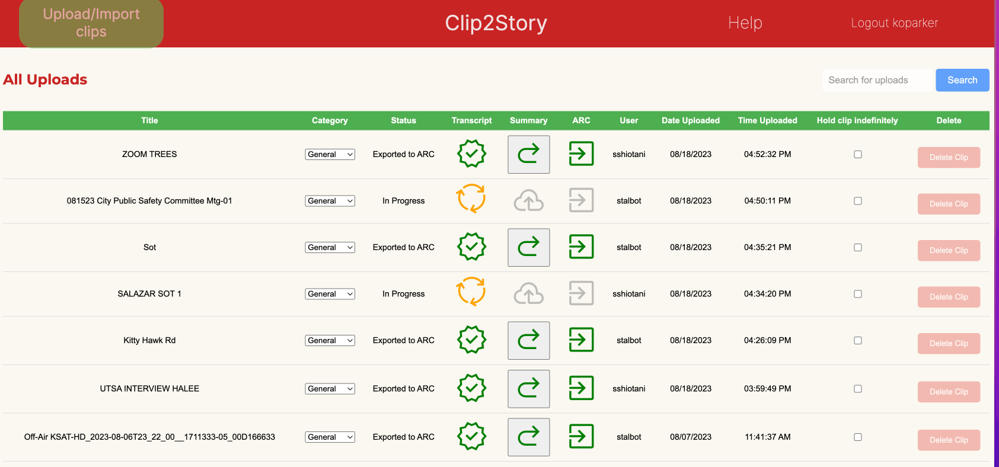
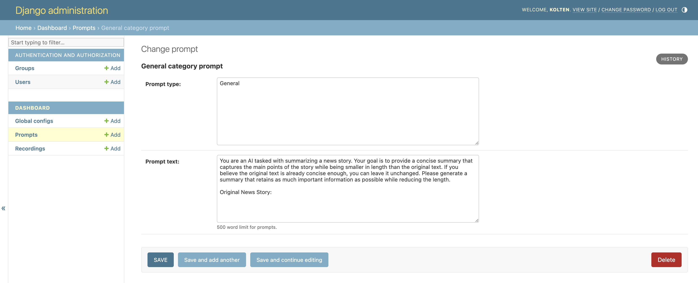

<!-- Improved compatibility of back to top link: See: https://github.com/othneildrew/Best-README-Template/pull/73 -->
<a name="readme-top"></a>
<!--
*** Thanks for checking out the Best-README-Template. If you have a suggestion
*** that would make this better, please fork the repo and create a pull request
*** or simply open an issue with the tag "enhancement".
*** Don't forget to give the project a star!
*** Thanks again! Now go create something AMAZING! :D
-->


<!-- PROJECT SHIELDS -->
<!--
*** I'm using markdown "reference style" links for readability.
*** Reference links are enclosed in brackets [ ] instead of parentheses ( ).
*** See the bottom of this document for the declaration of the reference variables
*** for contributors-url, forks-url, etc. This is an optional, concise syntax you may use.
*** https://www.markdownguide.org/basic-syntax/#reference-style-links

[![Contributors][contributors-shield]][contributors-url]
[![Forks][forks-shield]][forks-url]
[![Stargazers][stars-shield]][stars-url]
[![Issues][issues-shield]][issues-url]
[![MIT License][license-shield]][license-url]
[![LinkedIn][linkedin-shield]][linkedin-url]
-->


<!-- PROJECT LOGO -->
<br />
<div align="center">
  <a href="https://github.com/associatedpress/">
    
  </a>

<h3 align="center">Clip2Story</h3>

<!--  <p align="center">
    project_description
    <br />
    <a href="https://github.com/github_username/repo_name"><strong>Explore the docs »</strong></a>
    <br />
    <br />
    <a href="https://github.com/github_username/repo_name">View Demo</a>
    ·
    <a href="https://github.com/github_username/repo_name/issues">Report Bug</a>
    ·
    <a href="https://github.com/github_username/repo_name/issues">Request Feature</a>
  </p> -->
</div>


<!-- TABLE OF CONTENTS -->
<details>
  <summary>Table of Contents</summary>
  <ol>
    <li>
      <a href="#about-the-project">About The Project</a>
      <ul>
        <li><a href="#project-objectives">Project Objectives</a></li>
        <li><a href="#how-it-operates">How It Operates</a></li>
        <li><a href="#built-with">Built With</a></li>
      </ul>
    </li>
    <li>
      <a href="#getting-started">Getting Started</a>
      <ul>
        <li><a href="#production">Production</a></li>
        <li><a href="#prerequisites">Prerequisites</a></li>
        <li><a href="#installation">Installation</a></li>
      </ul>
    </li>
    <li><a href="#usage">Usage</a></li>
    <li><a href="#roadmap">Roadmap</a></li>
    <li><a href="#contributing">Contributing</a></li>
    <li><a href="#license">License</a></li>
    <li><a href="#contact">Contact</a></li>
  </ol>
</details>


<!-- ABOUT THE PROJECT -->
## About The Project

Clip2Story is a prototype web application that transcribes news video clips, summarizes transcripts using OpenAI, and feeds summaries as the first draft of a story into a CMS.

This project was originally built for KSAT-TV in San Antonio, Texas. The Associated Press and Stanford University collaborated to develop this application as part of the Local News AI Initiative, funded by the [John S. and James L. Knight Foundation](https://knightfoundation.org/articles/ai-for-local-news-advancing-business-sustainability-in-newsrooms/), which aims to leverage AI for the benefit of local news.

The development team thanks the staff at [KSAT-TV](https://www.ksat.com/) and [Graham Media Group](https://www.grahammedia.com/) for proposing this project, and for their participation, feedback, and encouragement.



### Project Objectives

- **Reduce Workloads:** Decreasing the burden for journalists to post new stories on digital platforms.
- **Build New Capabilities:** Allowing journalists to experiment with generating text content from different types of videos.
- **Cost Effectiveness:** Running the system should not incur expenses greater than the savings or revenue gains generated by using it.


### How It Operates

Clip2Story functions through this process:

1. **Video Upload:** The system takes an input of pre-edited video clips uploaded via the web application or via the Trint transcription service.
2. **Transcription:** A transcript of the video is generated via a call to the Trint API.
3. **Approval of Transcript:** After a transcript is completed, the system awaits a journalist to review and/or edit the transcript for accuracy. (The dashboard is seen in the above image.)
4. **Summarization:** The validated transcript is summarized via a call to OpenAI's GPT 3.5 Turbo model via API. (GPT prompts are controlled via the Django Administration interface, see image below.)
5. **Keywording:** Relevant tags for the transcript are generated via a call to OpenAI's GPT 3.5 Turbo model via API.
6. **Publication:** The summary and keywords are uploaded to the Arc XP CMS via API as a draft story for review by a journalist.



<p align="right">(<a href="#readme-top">back to top</a>)</p>


### Built With

* [![Python][Python]][Python-url]


<p align="right">(<a href="#readme-top">back to top</a>)</p>


<!-- GETTING STARTED -->
## Getting Started

To do initial configuration and setting up of third-party apps, prompts, and user accounts; See the [administrators](docs/administrators.md) documentation. 

### Production
This application was originally designed to be hosted on Google Cloud Platform. See [GCP Deployment](docs/gcp_deployment.md) for the details. There is a job running every 30 minutes on Cloud Run that checks for and deletes old videos. See [Management Tasks and Jobs](docs/tasks_and_jobs.md) for details.

### Prerequisites

* Django
* Postgres
* Trint API access
* Arc XP API access
* OpenAI API access
* Google Cloud Platform (for production hosting)


### Installation

Install [Postgres.app](https://postgresapp.com/).

Create a local version of the database. For this step, you may need to locate the `createdb` command on your computer. This will vary depending on the version of Postgres.app that you installed.

```sh
# First try plain old createdb

createdb summarizerdb

# If the above doesn't work, try locating the createdb command in
# Postgres.app folder. Below is an example if you're on Postgres.app version 15

/Applications/Postgres.app/Contents/Versions/15/bin/createdb summarizerdb

```

Grab a copy of the codebase and install Python requirements.

```sh
git clone git@github.com:associatedpress/local-ai-ksat.git
cd local-ai-ksat
pipenv install --dev
```

> NOTE: All of the following commands should be executed
> on the command line, from the top-level `local-ai-ksat/` directory,
> unless otherwise specified.

Set up a `.env` file to store secrets and other project-specific environment variables.

```sh
cp env.template .env
```

Add your database username to the `.env` file:

```sh
echo DJANGO_DB_USER=$(whoami) >> .env
```

Migrate your local database (this will create all tables, fields, etc.).

```sh
# If you haven't already done so, activate the virtual environment
# by running "pipenv shell" from the top-level "local-ai-ksat/" directory

# Then navigate to the clip2story/ directory and update the database
cd clip2story/
python manage.py migrate
```

Create a superuser for the Django admin database

```sh
python manage.py createsuperuser
```

> **IMPORTANT**: Any time you install a new application dependency using `pipenv install`, you must regenerate the `requirements.txt` file
> used in the production deployment by running `pipenv lock -r > requirements.txt`. And of course, commit that update along with any code updates in order to make the new software dependencies available in production.

#

<p align="right">(<a href="#readme-top">back to top</a>)</p>


<!-- USAGE EXAMPLES -->
## Usage

For day-to-day usage, use the below commands.

> Note, you may also need to occassionally migrate your database,
> per the instructions above in Setup

```sh
# Activate the virtual environment
cd local-ai-ksat/
pipenv shell

# Fire up the dev server
cd clip2story/
python manage.py runserver
```

Use your superuser credentials to log into:

- the app at http://localhost:8000
- Django admin: http://localhost:8000/admin

<p align="right">(<a href="#readme-top">back to top</a>)</p>


<!-- ROADMAP -->
## Roadmap

At the end of the MVP development period, these were the features that we thought would be useful to have in the future:

- [ ] Integration with a variety of other transcription services, especially an OpenAI Whisper model because it performed really well in a separate project for Michigan Radio.
- [ ] Integration with a variety of other content management systems
- [ ] Native UI management and help guides that do not use the Django interface


<p align="right">(<a href="#readme-top">back to top</a>)</p>


<!-- CONTRIBUTING -->
## Contributing

Contributions are what make the open-source community such an amazing place to learn, inspire, and create. Any contributions you make are **greatly appreciated**.

If you have a suggestion that would make this better, please fork the repo and create a pull request. You can also simply open an issue with the tag "enhancement".
Don't forget to give the project a star! Thanks again!

1. Fork the Project
2. Create your Feature Branch (`git checkout -b feature/AmazingFeature`)
3. Commit your Changes (`git commit -m 'Add some AmazingFeature'`)
4. Push to the Branch (`git push origin feature/AmazingFeature`)
5. Open a Pull Request

<p align="right">(<a href="#readme-top">back to top</a>)</p>


<!-- LICENSE -->
## License

Distributed under the GNU GENERAL PUBLIC LICENSE. See `LICENSE` for more information.

<p align="right">(<a href="#readme-top">back to top</a>)</p>


<!-- CONTACT -->
## Contact

*The Associated Press does not provide technical support for this open-source application.*

Serdar Tumgoren - [@zstumgoren](https://github.com/zstumgoren) - tumgoren@stanford.edu

Project Link: [https://github.com/associatedpress/local-ai-ksat](https://github.com/associatedpress/local-ai-ksat)


<!-- ORIGINAL DEVELOPERS -->
### Original Developers

* Ryan Leahy - [@RyanLeahy](https://github.com/RyanLeahy) - Gonzaga University
* Ozge Terzioglu - [@ozterz](https://github.com/ozterz) - Stanford University
* Kalyn Epps - Stanford University

<p align="right">(<a href="#readme-top">back to top</a>)</p>


<!-- MARKDOWN LINKS & IMAGES -->
<!-- https://www.markdownguide.org/basic-syntax/#reference-style-links -->
[contributors-shield]: https://img.shields.io/github/contributors/github_username/repo_name.svg?style=for-the-badge
[contributors-url]: https://github.com/github_username/repo_name/graphs/contributors
[forks-shield]: https://img.shields.io/github/forks/github_username/repo_name.svg?style=for-the-badge
[forks-url]: https://github.com/github_username/repo_name/network/members
[stars-shield]: https://img.shields.io/github/stars/github_username/repo_name.svg?style=for-the-badge
[stars-url]: https://github.com/github_username/repo_name/stargazers
[issues-shield]: https://img.shields.io/github/issues/github_username/repo_name.svg?style=for-the-badge
[issues-url]: https://github.com/github_username/repo_name/issues
[license-shield]: https://img.shields.io/github/license/github_username/repo_name.svg?style=for-the-badge
[license-url]: https://github.com/github_username/repo_name/blob/master/LICENSE.txt
[linkedin-shield]: https://img.shields.io/badge/-LinkedIn-black.svg?style=for-the-badge&logo=linkedin&colorB=555
[linkedin-url]: https://linkedin.com/in/linkedin_username
[product-screenshot]: images/screenshot.png
[Next.js]: https://img.shields.io/badge/next.js-000000?style=for-the-badge&logo=nextdotjs&logoColor=white
[Next-url]: https://nextjs.org/
[React.js]: https://img.shields.io/badge/React-20232A?style=for-the-badge&logo=react&logoColor=61DAFB
[React-url]: https://reactjs.org/
[Vue.js]: https://img.shields.io/badge/Vue.js-35495E?style=for-the-badge&logo=vuedotjs&logoColor=4FC08D
[Vue-url]: https://vuejs.org/
[Angular.io]: https://img.shields.io/badge/Angular-DD0031?style=for-the-badge&logo=angular&logoColor=white
[Angular-url]: https://angular.io/
[Svelte.dev]: https://img.shields.io/badge/Svelte-4A4A55?style=for-the-badge&logo=svelte&logoColor=FF3E00
[Svelte-url]: https://svelte.dev/
[Laravel.com]: https://img.shields.io/badge/Laravel-FF2D20?style=for-the-badge&logo=laravel&logoColor=white
[Laravel-url]: https://laravel.com
[Bootstrap.com]: https://img.shields.io/badge/Bootstrap-563D7C?style=for-the-badge&logo=bootstrap&logoColor=white
[Bootstrap-url]: https://getbootstrap.com
[JQuery.com]: https://img.shields.io/badge/jQuery-0769AD?style=for-the-badge&logo=jquery&logoColor=white
[JQuery-url]: https://jquery.com 
[Python]:https://img.shields.io/badge/Python-3776AB?style=for-the-badge&logo=python&logoColor=white
[Python-url]:https://www.python.org/
